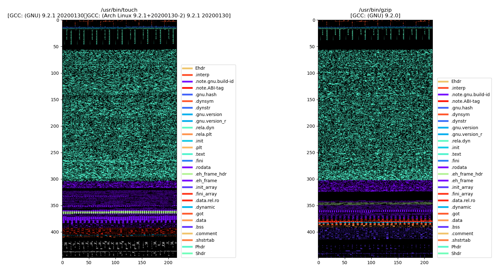

# elf-plotter

This is a simple python tool to plot the bytes of a file in the
[Executable and Linkable Format (ELF)](https://man7.org/linux/man-pages/man5/elf.5.html)
and colorize the headers, e.g. the
* ELF Header (`Ehdr`),
* Program Header (`Phdr`), and
* Section header (`Shdr`),

and sections, e.g.

* `.text`,
* `.data`,
* …,

in different colors.

The individual headers and sections will always get the same colors, e.g.
`.text` will always be displayed in the color `#4ef3cd`.

The brightness of the pixels signifies their byte-value, e.g. for `.text`,
a value of
`0xff` will be shown as `#4ef3cd`,
`0x80` will be shown as `#277a67`, and
`0x00` will be shown as `#000000`.

You can also choose to only highlight certain parts (headers / sections)
verbatim or using regex (see [Advanced Examples](#advanced-examples) below).

The subplot title is the name of the file, and the file's `.comment` section
which conveniently contains some compiler information (at least for `gcc` and `clang`).

## Dependencies:

* [pyelftools](https://github.com/eliben/pyelftools)

## Installation:

```bash
$ git clone https://github.com/felsenhower/elf-plotter
$ cd elf-plotter
$ pip install -r requirements.txt
```

## Usage:

### Basic Examples:

Simply call `plot_elf.py` with a list of ELF files,
e.g. exexutables or .o files:

```bash
$ ./plot_elf.py "/path/to/elffile.o"
```

For example, to compare `gzip` and `touch`, you can do

```bash
$ ./plot_elf.py "$(which touch)" "$(which gzip)"
```

which looks something like this:

[](example.png)


### Advanced examples:

You can also specifiy certain parts (headers or sections) that you wish to
exclusively highlight in the plot. Write a plus sign ("+") and specify a comma-separated list of
parts you want to highlight. E.g. to only highlight the `.text` section:

```bash
$ ./plot_elf.py +.text "$(which touch)" "$(which gzip)"
```

Only highlight `.text` and `.data`:

```bash
$ ./plot_elf.py +.text,.data "$(which touch)" "$(which gzip)"
```

If the filter list is the first argument (i.e. before all filenames), it will
be used on all files.
Otherwise (i.e. if the filter list comes after a filename), it will be used only
on that file. E.g., to highlight `which`'s `.data` section, `gzip`'s `.comment`
section, and the `.text` section of both of them:

```bash
$ ./plot_elf.py +.text "$(which touch)" +.data "$(which gzip)" +.comment
```

Use two plusses, if you want to strip away all the bytes that are not highlighted:

```bash
$ ./plot_elf.py ++.text,.data "$(which touch)" "$(which gzip)"
```

If the first filter list has a double plus, `plot_elf.py` will behave as if
every filter list had a double plus.

You can also use regex by enclosing it into two slashes. E.g., to highlight
`.text` and every section that contains `data` and begins with a dot
(make sure you use apostrophes!):

```bash
$ ./plot_elf.py '+.text,/^..*data.*/' "$(which touch)" "$(which gzip)"
```

Or to **only** show the headers:

```bash
$ ./plot_elf.py '++/^[^.].*hdr/' "$(which touch)"  "$(which gzip)"
```
